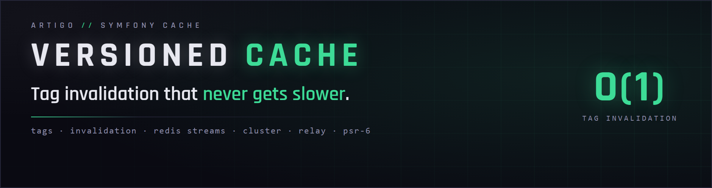
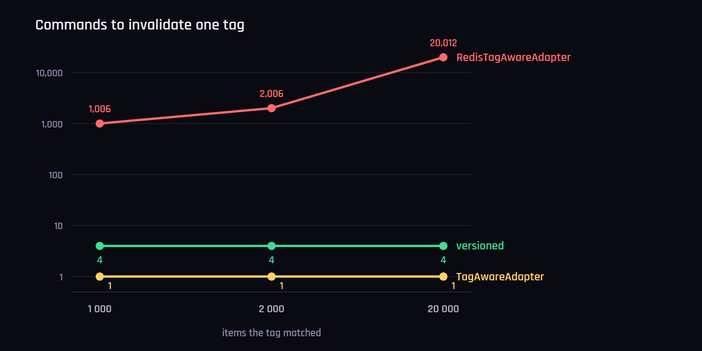
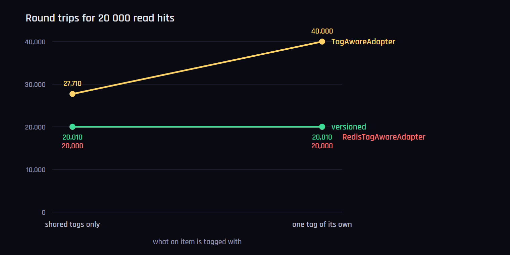

<p align="center">
	
</p>

**A drop-in `symfony/cache` adapter that invalidates a tag in four Redis commands — whether it matches three items or twenty thousand.**

> **Its other half is [`artigo/cache-stampede`](https://github.com/artigo-dev/cache-stampede).**
> This package keeps an invalidation from being expensive; that one keeps the
> invalidated items from being recomputed by every server at once. Neither
> depends on the other — see [Use them together](#use-them-together).

## The problem

`RedisTagAwareAdapter` keeps a SET per tag. Invalidating one reads that SET and
unlinks every member, in a single blocking Lua loop — instant for a handful of
items, and a stall when a tag fans out to thousands, during which the
single-threaded server is doing nothing else for anybody.

Symfony's other tag adapter, `TagAwareAdapter`, already invalidates in one
command: a version key per tag, deleted by `invalidateTags()`, compared on
read. It pays on the read side instead — the tag versions have to be fetched
whenever they were not seen within 150 ms, and on every miss — and it keeps
one version key per tag ever written, without a TTL. So Symfony holds two
corners of the design space: cheap invalidation with expensive reads, and
cheap reads with invalidation that grows with the match count.

This adapter is the third corner — `TagAwareAdapter`'s invalidation cost with
`RedisTagAwareAdapter`'s read cost, and storage bounded by one trimmed stream.
It keeps no index at all. An invalidation appends **one rule** to a
Redis stream and returns; the work of noticing is left to whoever reads next.
Every item is written carrying the stream's last entry id — its watermark — and
a read evaluates only the rules newer than that against the item's own tags. A
stale item is unlinked by the reader that finds it, and otherwise expires by its
TTL.

**Nothing accumulates in Redis.** Every key here is bounded by its own TTL, save
one rules stream per pool that the retention trims. A tag SET is not: an item
that expires by its TTL keeps its id in every SET that names it until that tag
is next invalidated, and the SETs carry no TTL, so eviction cannot reclaim them
either.

Ordering is causal rather than clock-based: stream ids are generated by the node
that owns the stream and are monotonic, so nothing anywhere compares two clocks.

## Installation

```bash
composer require artigo/versioned-cache
```

## Usage

It is a drop-in `TagAwareAdapterInterface` — the same constructor shape as
`RedisTagAwareAdapter`, the same DSNs, the same marshallers.

```php
use Artigo\Cache\Adapter\VersionedRedisTagAwareAdapter;
use Symfony\Component\Cache\Adapter\RedisAdapter;

$pool = new VersionedRedisTagAwareAdapter(
    RedisAdapter::createConnection('redis://127.0.0.1'),
);

$item = $pool->getItem('article-1');
$item->set($article)->tag(['articles', 'front-page']);
$pool->save($item);

$pool->invalidateTags(['articles']);   // four commands, whatever matched
```

Three settings beyond Symfony's:

```php
new VersionedRedisTagAwareAdapter(
    $redis,
    namespace: 'app',
    defaultLifetime: 0,
    marshaller: null,
    rulesRetentionSeconds: 2_592_000,  // 30 days; also the maximum item lifetime
    rulesCacheMs: 1_000,               // 0 for exact reads, at a round trip each
    rulesCache: null,                  // APCu where enabled; any PSR-6 pool; false for none
);
```

`rulesRetentionSeconds` is how long invalidation rules are kept, and therefore
the longest an item may live: an item must never outlive the rule that made it
stale, or it would come back from the dead once that rule is trimmed away. A
longer TTL is capped to it, and logged once.

`rulesCacheMs` is how long a rule set may be reused before it is refreshed. It
is the window within which an invalidation becomes visible. A refresh fetches
only what was appended since the last one, and a read is judged against the
newest rule per tag it carries, so neither the refresh nor the read grows with
the length of the log.

`rulesCache` is where the workers of a server share that rule set, so that a
fresh process — every request, under PHP-FPM — adopts it instead of loading the
whole stream before its first hit. It is an `ApcuAdapter` by default where APCu
is enabled, any PSR-6 pool you pass otherwise, or `false` to keep the set per
instance. When the set turns stale, one worker is elected to refresh it (a
non-blocking `flock()` on a file, per host, the primitive `LockRegistry` uses)
and the others keep it for that read; on a server whose pool was just emptied,
one worker loads the stream and the others wait for it, briefly, instead of
loading it too.

## Symfony framework

`framework.cache.pools` can use the adapter once it has an abstract service to
build pools from, the way FrameworkBundle defines `cache.adapter.redis_tag_aware`.
The `provider` may be a DSN; Symfony's own connection factory resolves it.

```yaml
# config/services.yaml
services:
    cache.adapter.versioned_redis:
        class: Artigo\Cache\Adapter\VersionedRedisTagAwareAdapter
        abstract: true
        arguments:
            - !abstract 'Redis connection service'
            - ''    # namespace
            - 0     # default lifetime
            - '@?cache.default_marshaller'
        calls:
            - [setLogger, ['@?logger']]
        tags:
            - { name: cache.pool, provider: cache.default_redis_provider, clearer: cache.default_clearer, reset: reset }
            - { name: monolog.logger, channel: cache }

# config/packages/cache.yaml
framework:
    cache:
        pools:
            app.articles:
                adapter: cache.adapter.versioned_redis
                provider: 'redis://127.0.0.1'
```

The three settings beyond Symfony's are the fifth to seventh constructor
arguments; add them to `arguments` to change them. The seventh takes a pool
service for the shared rule set, `false` for none, or nothing for APCu.

## Measured, not asserted

`benchmarks/bench.php` runs this adapter, Symfony's `RedisTagAwareAdapter` and
Symfony's generic `TagAwareAdapter` (over a `RedisAdapter`) through the same
scenarios. Wall clock is worth only as much as the link it was measured over,
so every row carries the commands Redis executed and, where it differs, the
socket reads it took to receive them — round trips, in all but name — neither
of which moves when the network does.

20 000 items, 18 tags each, Redis 8.8, PHP 8.5, one run on one machine:

| Scenario | **`versioned`** | `RedisTagAwareAdapter` | `TagAwareAdapter` |
|---|---|---|---|
| fill (commands · round trips) | 60 060 · 20 798 | 102 978 · 21 349 | 61 595 · **41 059** |
| overwrite (commands · round trips) | 60 010 · 20 748 | **40 000** · 20 852 | 46 615 · 27 679 |
| read hit (commands) | 20 010 | 20 000 | 27 710 |
| invalidate 1 000 matches | **4** · 0.001 s | 1 006 · 0.003 s | **1** · 0.001 s |
| invalidate 2 000 matches | **4** · 0.000 s | 2 006 · 0.003 s | **1** · 0.000 s |
| invalidate 20 000 matches | **4** · 0.000 s | 20 012 · 0.030 s | **1** · 0.000 s |
| read after invalidating everything | 40 019 · 18.5 s | **20 000 · 9.1 s** | 40 000 · 20.3 s |
| memory reclaimed | 18.3 MB | 16.6 MB | **0.0 MB** |
| 10 000 invalidations matching nothing | 40 000 · 5.0 s | 50 000 · 4.8 s | **10 000** · 4.6 s |
| read hit, 10 000 rules behind | 20 010 · 10.0 s | 20 000 · 9.4 s | 28 162 · 14.2 s |
| read hit, fresh pool every 10 reads, 10 000 rules behind | 20 020 · 19.6 s | 20 000 · 9.2 s | 40 000 · 20.3 s |
| the same, the rule set not shared | 22 000 · 68.0 s | &mdash; | &mdash; |

Three of those rows are the questions a rule log invites.

**What does a long log cost the readers?** Ten thousand invalidations land
behind a fresh fill, so every item is older than every rule. Ten commands over
twenty thousand reads — one refresh per second, the first carrying the ten
thousand rules and the rest carrying nothing — because a refresh fetches only
what was appended, and a read is judged against the newest rule per tag rather
than against the log. `TagAwareAdapter` pays for the same log differently: its
versions are per tag, so a read whose tags it has not seen within 150 ms
fetches them again.

**What does a fresh process pay?** Under PHP-FPM every request is one. The last
two rows re-create the pool every ten reads, behind those ten thousand rules.
Sharing the rule set through APCu, a fresh pool adopts a ten-thousand-tag set
in about 5 ms and asks Redis for nothing; without sharing it loads the stream:
2 000 more commands, about 30 ms per pool. `TagAwareAdapter` has no set to
lose, but a fresh pool has no known versions either, so every read costs two
round trips; `RedisTagAwareAdapter` holds nothing between requests and pays
nothing for a fresh one.

```bash
docker compose up -d
php benchmarks/bench.php items=20000
php benchmarks/bench.php items=20000 unique=1
```



**Four commands, always.** A thousand matches or twenty thousand, the
invalidation is one `XADD` and a trim. The eager side tracks the match count
exactly — 1 006, 2 006, 20 012 — so the distance between them belongs to
whoever grows. `TagAwareAdapter` needs one command, and always did: the
difference to it is on the read side.

### With a tag of its own on every item

The tags applications really use include one per entity — `article-42` — which
no other item shares and no per-tag cache can have warmed. The same run with
one of the 18 tags being the item's own (`unique=1`):

| Scenario | **`versioned`** | `RedisTagAwareAdapter` | `TagAwareAdapter` |
|---|---|---|---|
| fill (commands · round trips) | 60 060 · 20 798 | 119 097 · 21 390 | 81 498 · **41 162** |
| overwrite (commands · round trips) | 60 010 · 20 753 | **40 000** · 20 838 | 60 021 · **41 123** |
| read hit (commands · round trips) | 20 010 · 20 010 | 20 000 · 20 000 | **40 000 · 40 000** |
| read hit, 10 000 rules behind | 20 010 · 9.8 s | 20 000 · 9.4 s | 40 000 · 19.9 s |
| read hit, fresh pool every 10 reads | 20 018 · 17.5 s | 20 000 · 9.3 s | 40 000 · 19.4 s |
| the same, the rule set not shared | 22 000 · 66.7 s | &mdash; | &mdash; |



Two round trips per read, hit or miss, is the cost of keeping the versions
next to the tags rather than the rules next to the pool. The rule log's read
side does not move between the two runs.

## What it is worse at

Every cache trades something, and two rows of that table are the price.

- **Memory comes back lazily.** An invalidated item holds its RAM until a reader
  unlinks it or its TTL runs out, so reading a *fully* invalidated set costs
  **2×** — 40 019 commands against 20 000.
- **The rules stream must not be evicted.** Like Symfony's tag Sets it carries
  no TTL, so that `volatile-*` and `noeviction` never touch it — run one of
  those. Under `allkeys-*` it can go; the read path then fails safe, and an item
  stamped with a rule the stream no longer remembers reads as a miss rather than
  a stale hit, at the price of recomputing the pool once.
- **Overwriting an existing item costs half again the commands** — 60 010
  against 40 000 — in the same single round trip: the write is an `HSETEX` and
  a `PEXPIRE` where Symfony's is one `SETEX`, because the item's watermark has
  to be rewritten whether its tags changed or not. On a *first* fill the
  position reverses, there being no tag index to build.
- **An invalidation becomes visible within `rulesCacheMs`**, one second by
  default. Pass `0` for exact reads, at a round trip each.
- **The rule set has to live somewhere between requests.** Without APCu and
  without a pool passed as `rulesCache`, every request loads the rules of the
  whole retention window before its first hit — about a hundred bytes per rule
  on the wire, so a month of invalidations, per request.
- **No tag enumeration.** `getTags()` and `getIdsMatchingTags()` have no
  counterpart here; there is no index to enumerate.
- **`rulesRetentionSeconds` is a ceiling on item lifetime**, not only a default.

## Conformance

Not our tests: `AdapterTestCase` and `TagAwareTestTrait`, the suite
`RedisTagAwareAdapter` itself has to pass, plus the PHP-FIG cache group's
`SimpleCacheTest` through Symfony's `Psr16Cache` bridge.

| suite | |
|---|---|
| PSR-6 conformance, with `TagAwareTestTrait` | **154 tests**, one skip |
| PSR-16 conformance | **212 tests**, one skip |
| whole suite | **411 tests**, two skips |

Both skips are `testPrune`: Redis expires items by itself, so this pool is not
`Pruneable` — and neither is the adapter it replaces. The rule stream trims
itself as rules are appended, so there is nothing to prune there either.

The rest of the suite is ours, and it breaks Redis on purpose: a rules stream
that cannot be read, a pipeline that never comes back, a stream deleted under
a running process, a client that serializes on its own. Each has to degrade to
a miss or a refusal, never to a stale hit and never to an exception in the
request.

## Use them together

The two packages answer the two halves of the same bad afternoon. Invalidate a
tag matching twenty thousand items and this adapter does it in four commands —
and then twenty thousand items are cold at once, and every server you have
starts recomputing them in parallel. That second part is what
[`artigo/cache-stampede`](https://github.com/artigo-dev/cache-stampede) is for.

```bash
composer require artigo/versioned-cache artigo/cache-stampede
```

```php
use Artigo\Cache\Adapter\VersionedRedisTagAwareAdapter;
use Artigo\Cache\MemoLock;
use Symfony\Component\Cache\Adapter\RedisAdapter;

$redis = RedisAdapter::createConnection('redis://127.0.0.1');

$pool = new VersionedRedisTagAwareAdapter($redis);
$pool->setCallbackWrapper(MemoLock::fromDsn('redis://127.0.0.1'));
```

Neither requires the other: this adapter runs under Symfony's own
`LockRegistry`, and those locks improve any Symfony pool. But an O(1)
invalidation and a herd that arrives one request at a time are the same problem
seen from both ends, and most setups want both dealt with.

Tags declared inside a locked callback still reach the item and still
invalidate — which is not obvious, since the lock wraps the very callback that
declares them, so `VersionedWithMemoLockTest` checks it here.

**A worked example is in the repository**, and it runs:

```bash
docker compose up -d
php examples/together.php
```

[`examples/together.php`](examples/together.php) warms a handful of tagged
cards, reads them back as hits, invalidates the tag they share, and reads them
again — printing how often the origin was actually reached at each step. What
the lock adds cannot show in one process, since a single request cannot
stampede itself; `benchmarks/stampede.php` in
[`artigo/cache-stampede`](https://github.com/artigo-dev/cache-stampede) releases
twelve real ones at the same cold key for that.

## Requirements

PHP 8.2+ · `symfony/cache` 6.4, 7.x or 8.x · **Redis 8.0+** · `ext-apcu`
recommended under PHP-FPM, for the shared rule set (see `rulesCache`)

Redis 8 is what makes the write path a single command: `HSETEX` sets an item's
fields and their expiry together, so there is no script on the write path and
no way for the data to land without the TTL that keeps it from outliving the
rules. The one script left is the appended rule — it needs the id `XADD` just
generated — and it travels as a body, so a `SCRIPT FLUSH`, restart or failover
changes nothing and no `FUNCTION LOAD` is ever needed. The key is given the
same TTL as its fields, so a `volatile-*` eviction policy still sees it.

Clients: **ext-redis** or **Relay**. Standalone or **cluster** — every command
the adapter issues touches a single key, so three masters are no different from
one. CI runs the suite on PHP 8.2 to 8.5 against Symfony 6.4, 7.4 and 8.1, on
Redis 8.0 and the current 8.x, through Relay, and against a three-master
cluster.

## Benchmarks

The suite ships **in this repository**, so every number above is something you
can re-run rather than take on trust:

| script | question it answers |
|---|---|
| `benchmarks/bench.php` | what does invalidating a tag cost as the match count grows, what does a read cost after it, and what does a fresh process pay — against both of Symfony's tag adapters? |
| `benchmarks/charts.php` | redraws the pictures above from those measurements |

`unique=1` gives every item one tag of its own, the entity tag applications
really use; `fresh=N` re-creates the pool every N reads in the FPM rows, the
way a request is a fresh process; `stores=` picks from `versioned`, `symfony`
(`RedisTagAwareAdapter`) and `tagaware` (`TagAwareAdapter` over a `RedisAdapter`).

The stampede benchmark moved to
[`artigo/cache-stampede`](https://github.com/artigo-dev/cache-stampede) with the
locks it measures.

## Licence

MIT. See [LICENSE](LICENSE).
